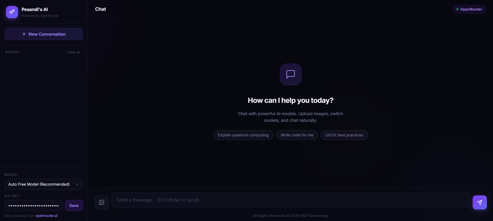

# AI Chatbot

A lightweight web chat app powered by OpenRouter models.

## Features
- Chat with multiple OpenRouter models
- Switch models from the sidebar
- Upload images for supported vision models
- Save API key in browser local storage
- Local chat history with quick conversation switching
- Responsive modern UI built with Tailwind CSS

## Project Structure
- index.html: Main UI layout and styling
- script.js: Chat logic, API calls, model/image handling, and local storage

## Live Demo
- Click on [simple-aichatbot.netlify.app]

## Notes
- Get your API key from [openrouter.ai/keys](https://openrouter.ai/keys)
- Save the API key from the bottom-left settings panel
- API key and conversation history are stored in your browser's local storage
- Uploaded images are sent to the selected model as base64 data URLs
- Large images (over 4MB) are blocked in the UI
- Free models are subject to rate limits (20 req/min, ~50 req/day on new accounts)

## Future Improvements
- Add markdown rendering for assistant responses
- Add streaming responses
- Add export/import for chats
- Add dark/light theme toggle

